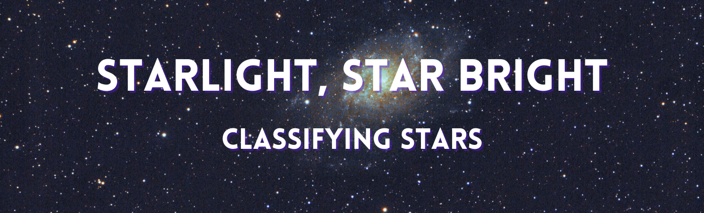

## Background

### j

## Data Dictionary
 
**`stars.csv`**
| Feature Name                                  | Description                                                                   |
| :-------------------------------------------- | :---------------------------------------------------------------------------- |
| Temperature                                   | Temperature in Kelvin                                                         |
| Relative Luminosity                           | The amount of light emitted by an object in a unit of time. Relative Luminosity is calculated as: Luminosity divided by the Luminosity of the Sun [source](https://en.wikipedia.org/wiki/Luminosity)                        |
| Relative Radius                               | Relative Radius is calculated as: Radius divided by the Average Radius of the Sun                                   |
| Absolute Magnitude                            |  A measure of the luminosity of a celestial object, on an inverse logarithmic astronomical magnitude scale. An object's absolute magnitude is defined to be equal to the apparent magnitude that the object would have if it were viewed from a distance of exactly 10 parsecs (32.6 light-years), without extinction (or dimming) of its light due to absorption by interstellar matter and cosmic dust. By hypothetically placing all objects at a standard reference distance from the observer, their luminosities can be directly compared among each other on a magnitude scale. [source](https://en.wikipedia.org/wiki/Absolute_magnitude)                                                            |
| Color                                         | General Color of Spectrum                                                     |
| Spectral Class                                | O,B,A,F,G,K,M [source](https://skyandtelescope.org/observing/stellar-spectral-types-03302016/)  |

#### Kelvin scale 
|                | From kelvins               | To kelvins                  |
| :------------- | :------------------------- | :-------------------------- |
| Celsius        | 	[°C] = [K] − 273.15 	  | [K] = [°C] + 273.15         |
| Fahrenheit     | 	[°F] = [K] × 9⁄5 − 459.67 |	[K] = ([°F] + 459.67) × 5⁄9 |

 On the Kelvin scale, pure water freezes at 273.15 K, and it boils at 373.15 K.
 [source](https://en.wikipedia.org/wiki/Kelvin)

#### Spectral Class

| Target Name: __Type__ | Description             |
| :-------------------- | :---------------------- |
| 0                     | Red Dwarf               | 
| 1                     | Brown Dwarf             | 
| 2                     | White Dwarf             | 
| 3                     | Main Sequence           | 
| 4                     | Super Giants            | 
| 5                     | Hyper Giants            | 

MATH:

    1 Solar Luminosity = 3.828 x 10^26 Watts [Average Luminosity of the Sun]

    1 Solar Radius = 6.9551 x 10^8m [Average Radius of the Sun]

### Feature Engineering
| Feature Name                | Description                                                                                 |
|-----------------------------|---------------------------------------------------------------------------------------------|
|||

## Initial Thoughts

## Project Steps
### 1. Acquire

### 2. Prepare
**Missing Values**

**Feature Engineering**

**Preprocessing**

### 3. Explore

#### Hypotheses
**Hypothesis**
> 

**Hypothesis**
>

**Hypothesis**
> 

**Hypothesis**
> 

**Hypothesis**
> 

### 4. Model

### Final Model

### 5. Conclusion

#### Key Findings
- 

#### What was the best model?

## How to Reproduce
All files are reproducible and available for download and use.
- [x] Read this README.md
- [ ] Download the aquire.py, prepare.py, and Final-Report.ipynb files
- [ ] Run Final-Report.ipynb
