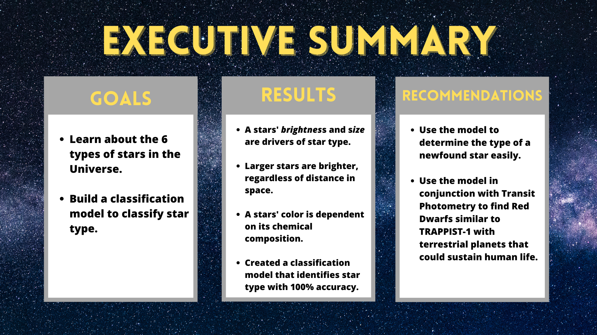

## Background
https://www.eso.org/public/usa/news/eso1615/

## Data Dictionary
 
**`stars.csv`**
| Feature Name                                  | Description                                                                   |
| :-------------------------------------------- | :---------------------------------------------------------------------------- |
| Temperature                                   | Temperature in Kelvin                                                         |
| Relative Luminosity                           | Amount of light emitted by an object in a unit of time.  `Relative Luminosity = Luminosity / Luminosity of the Sun`   [luminosity-wiki](https://en.wikipedia.org/wiki/Luminosity)|
| Relative Radius                               | Radius of a star  `Relative Radius = Radius / Radius of the Sun`                                   |
| Absolute Magnitude                            | Luminosity of a celestial object, on an _inverse logarithmic astronomical magnitude scale_.     The absolute magnitude of a star is equal to the apparent magnitude that the object would have if it were viewed from a distance of exactly 10 parsecs (32.6 light-years), without extinction of its light due to absorption by interstellar matter and cosmic dust. By hypothetically placing all objects at a standard reference distance from the observer, _their luminosities can be directly compared among each other on a magnitude scale_.   [absolute-magnitude-wiki](https://en.wikipedia.org/wiki/Absolute_magnitude)                                                            |
| Color                                         | Red, Orange Red, Orange, Pale Yellow Orange, Yellow White, White, Blue White, Blue. "The surface temperature of a star determines the color of light it emits".                                                  |
| Spectral Class                                | O,B,A,F,G,K,M   [spectral-wiki](https://en.wikipedia.org/wiki/Stellar_classification)  |

| Target Name           | Description             |
| :-------------------- | :---------------------- |
| 0 : Red Dwarf         | Smallest, longest burning (life), lowest temperature star.   "A red dwarf, which is half as massive as the sun, can last 80 to 100 billion years, which is far longer than the universe's age of 13.8 billion years. This long lifetime is one reason red dwarfs are considered to be good sources for planets hosting life, because they are stable for such a long time."  [red-dwarf](https://www.space.com/23772-red-dwarf-stars.html)                       | 
| 1 : Brown Dwarf       | Star that cannot sustain nuclear fusion in their cores. Considered a transitional object between a star and a planet.   [brown-dwarf](https://cdn.mos.cms.futurecdn.net/K4FXX56wkmoU8Urex2KuNV-970-80.jpg.webp)| 
| 2 : White Dwarf       | Star that runs out of hydrogen and helium and collapses inward on itself.   White dwarfs are incredibly dense. "According to NASA, the gravity on the surface of a white dwarf is 350,000 times that of gravity on Earth. That means a 150-pound (68-kilogram) person on Earth would weigh 50 million pounds (22.7 million kg) on the surface of a white dwarf."   [white-dwarf](https://www.space.com/23756-white-dwarf-stars.htm) | 
| 3 : Main Sequence     | Main sequence stars fuse hydrogen atoms to form helium atoms in their cores. About 90 percent of the stars in the universe, including the sun, are main sequence stars. These stars can range from about a tenth of the mass of the sun to up to 200 times as massive.   [main-sequence](https://www.space.com/22437-main-sequence-stars.html)           | 
| 4 : Super Giants      | Supergiant stars have two colors: red and blue. Supergiants are the most massive stars out there, ranging between 10 to 70 solar masses, and can range in brightness from 30,000 to hundreds of thousands of times the output of the Sun. They have very short lifespans, living from 30 million down to just a few hundred thousand years. Supergiants seem to always detonate as Type II supernovae at the end of their lives.   [super-giants](https://www.universetoday.com/25325/supergiant-star/)           | 
| 5 : Hyper Giants      | The largest stars in the universe. Hypergiant stars were first identified separately from other supergiants because they are significantly brighter; that is, they have a larger luminosity than others. Studies of their light output also show that these stars are losing mass very rapidly. That "mass loss" is one defining characteristic of a hypergiant. The others include their temperatures (very high) and their masses (up to many times the mass of the Sun)   [hyper-giants](https://www.thoughtco.com/hypergiant-stars-behemoths-of-the-galaxy-3073593)           | 

Click here for a deep dive into the data dictionary

 
#### Kelvin scale 
|                | From kelvins               | To kelvins                  |
| :------------- | :------------------------- | :-------------------------- |
| Celsius        | 	[°C] = [K] − 273.15 	  | [K] = [°C] + 273.15         |
| Fahrenheit     | 	[°F] = [K] × 9⁄5 − 459.67 |	[K] = ([°F] + 459.67) × 5⁄9 |

 On the Kelvin scale, pure water freezes at 273.15 K, and it boils at 373.15 K.
 [source](https://en.wikipedia.org/wiki/Kelvin)

#### Spectral Class

MATH:

    1 Solar Luminosity = 3.828 x 10^26 Watts [Average Luminosity of the Sun]

    1 Solar Radius = 6.9551 x 10^8m [Average Radius of the Sun]

### Feature Engineering
| Feature Name                   | Description                                                                                 |
|:------------------------------ |:------------------------------------------------------------------------------------------- |
| scaled_temperature             | Temperature scaled using a MinMaxScaler                                                     |
| scaled_luminosity              | Luminosity scaled using a MinMaxScaler                                                      |
| scaled_radius                  | Radius scaled using a MinMaxScaler                                                          |
| scaled_absolute_mangnitude     | Absolute Magniutde scaled using a MinMaxScaler                                              |
| quantiled_temperature          | MinMaxScaled Temperature scaled using a Quantile Transformer                                |
| quantiled_luminosity           | MinMaxScaled Luminosity scaled using a Quantile Transformer                                 |
| quantiled_radius               | MinMaxScaled Radius scaled using a Quantile Transformer                                     |
| quantiled_absolute_mangnitude  | MinMaxScaled Absolute Magnitude scaled using a Quantile Transformer                         |

## Initial Thoughts

## Project Steps
### 1. Acquire

### 2. Prepare

**Feature Engineering**

**Preprocessing**

### 3. Explore

#### Hypotheses
**Hypothesis**
> 

**Hypothesis**
>

**Hypothesis**
>

### 4. Model

### Final Model

### 5. Conclusion

#### Key Findings

## How to Reproduce
All files are reproducible and available for download and use.
- [x] Read this README.md
- [ ] Download the aquire.py, prepare.py, and Final-Report.ipynb files
- [ ] Run Final-Report.ipynb
